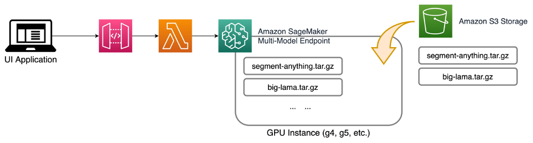

# Creative Content Assisted by Generative AI using Amazon SageMaker: Magic Eraser

---

## Introduction

we will demonstrate how to create a inpainting eraser that can remove any object from an image using Amazon SageMaker. This tool can come in handy when you need to remove photobombs, get rid of unwanted objects, or even clean up backgrounds. Especially for graphic designers and creative artists who are repeating these task on the daily bases. This can be a great efficiency booster to enhance their creative workflow.

This example has 2 notebooks: `0_setup.ipynb` and `1_inpainting_eraser_using_genai.ipynb`. Please run them in sequence. **Notebooks are tested using pytorch kernel on SageMaker Notebook Instance using `ml.g4dn.xlarge`**

---

## Solution Overview
Our solution for inpainting eraser involves two main steps. The first step is to create a segmentation mask of the object to be removed based on a pixel coordinate input. Then second step is to “erase”, which fills the area using the contexts from the rest of the image. 

To generate segmentation, we used a foundation model developed by Meta Research called [Segment Anything Model (SAM)](https://segment-anything.com/). This model is trained on a massive dataset called SA-1B with over 11 million images and 1.1 billion segmentation masks.  This massive scale gave Sam model unprecedented ability to identify and isolate objects from an image out of the box without training.

To erase the object, we used a second model called [Resolution-robust Large Mask Inpainting with Fourier Convolutions (LaMa)](https://advimman.github.io/lama-project/) developed by Roman Suvorov. This model can fill in missing parts of images caused by irregular masks.

Here is the Architecture Diagram:

Both models are open source and hosted using Amazon SageMaker Multi-Model Endpoints (MME). MME offer a cost-effective and scalable solution for deploying multiple models. By using a shared serving container, MME allows for the hosting of multiple models on a single SageMaker real-time endpoint. This unique feature enables time-sharing of memory resources across models, which optimizes endpoint utilization and helps reduce hosting costs. 

To learn more about MMEs and MMEs with GPUs, refer to [Create a Multi-Model Endpoint](https://docs.aws.amazon.com/sagemaker/latest/dg/create-multi-model-endpoint.html) documentation and [Run multiple deep learning models on GPU with Amazon SageMaker multi-model endpoints](https://aws.amazon.com/blogs/machine-learning/run-multiple-deep-learning-models-on-gpu-with-amazon-sagemaker-multi-model-endpoints/) on the AWS Machine Learning Blog.