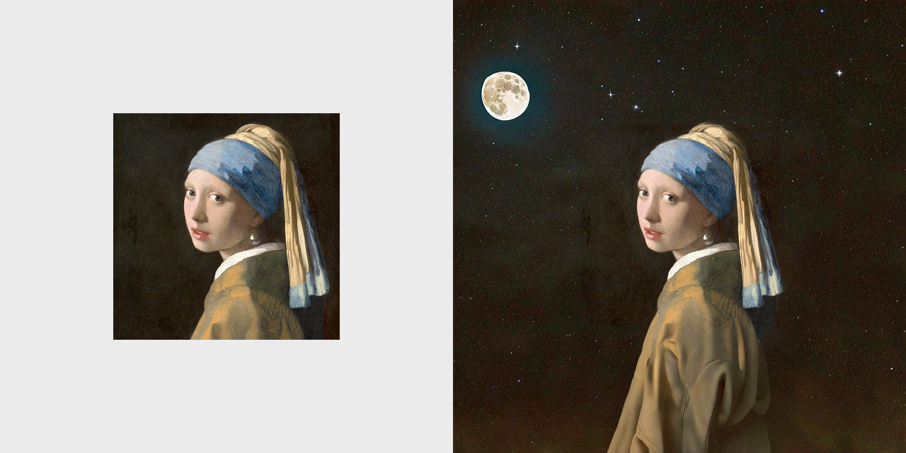

## Creative Content Assisted by Generative AI using Amazon SageMaker: Inpainting Fill and Outpainting

---

The first example is called **inpainting fill**. It is the process of replacing a portion of an image with synthesized content based on a textual prompt. We will accomplish this using Stable Diffusion XL(SDXL) model from Amazon Bedrock.

The workflow is to provide the model with three inputs:

- A mask image that outlines the portion to be replaced
- A textual prompt describing the desired contents
- The original image

Bedrock can then produce a new image that replaces the masked area with the object, subject, or environment described in the prompt.

You can follow this example [here](../inpainting_eraser/) to host a Segment Anything Model (SAM) and generate the masks, but we also provided a [mask image](data/mask.png) you can use out of the box for this example.

**Note:** The mask image must have the same resolution and aspect ratio as the image being inpainted upon.

---

The second example is called **outpainting**. It is the process technique that extends or extrapolates beyond the original image borders. We will accomplish this using Titan Image Generator from Amazon Bedrock.

The workflow is to provide the model with three inputs:

- Extending the canvas of orginal image
- creating an mask of extended area
- A textual prompt describing the desired contents

Titan Image generator can fill the extending area according to the textual prompt. This is very useful in situation will you need to change aspect ratio of the image, expanding repetitive textures, or expanding the scope of a scene by filling additional space and objects.

