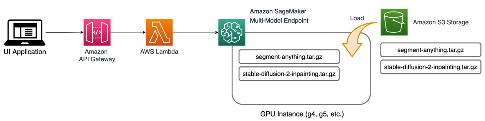

## Creative Content Assisted by Generative AI using Amazon SageMaker: Magic Fill/Replace
---

## Introduction

we will demonstrate how to create a magic fill/replace tool that can erase, fill, and replace background of any object from an image using Amazon SageMaker. The capability of this tool is illustrated in the digram below:

This example has 2 notebooks: `0_setup.ipynb` and `1_magic_fill_replace_using_genai.ipynb`. Please run them in sequence. **Notebooks are tested using pytorch kernel on SageMaker Notebook Instance using `ml.g4dn.xlarge`**

---

## Solution Overview
This solution not only can erase object from image, it also can fill object or replace background with a simple text prompt. The diagram below illustrated the capabilities.

To generate segmentation, we used a foundation model developed by Meta Research called **[Segment Anything Model (SAM)](https://segment-anything.com/) - Apache-2.0 license**. This model is trained on a massive dataset called SA-1B with over 11 million images and 1.1 billion segmentation masks.  This massive scale gave Sam model unprecedented ability to identify and isolate objects from an image out of the box without training.

To fill/replace, we will use **[Stable Diffusion (SD) Inpaint](https://huggingface.co/stabilityai/stable-diffusion-2-inpainting) - CreativeML Open RAIL++-M License** model from Stabilityai. This model does image-to-image, but also allows you to supply a mask. The model take the entire image as context and generate the mask region according to a set of text prompts.

Here is the Architecture Diagram:

Both models are open source and hosted using Amazon SageMaker Multi-Model Endpoints (MME). MME offer a cost-effective and scalable solution for deploying multiple models. By using a shared serving container, MME allows for the hosting of multiple models on a single SageMaker real-time endpoint. This unique feature enables time-sharing of memory resources across models, which optimizes endpoint utilization and helps reduce hosting costs. 

To learn more about MMEs and MMEs with GPUs, refer to [Create a Multi-Model Endpoint](https://docs.aws.amazon.com/sagemaker/latest/dg/create-multi-model-endpoint.html) documentation and [Run multiple deep learning models on GPU with Amazon SageMaker multi-model endpoints](https://aws.amazon.com/blogs/machine-learning/run-multiple-deep-learning-models-on-gpu-with-amazon-sagemaker-multi-model-endpoints/) on the AWS Machine Learning Blog.